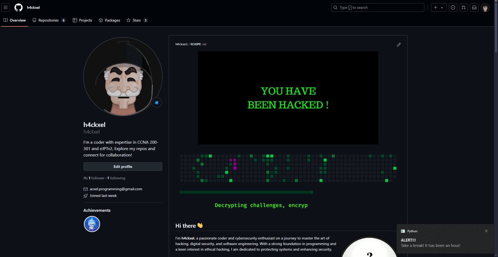

# 🕒 Notificador de Toma de Descansos con Python

Este script en Python envía una notificación cada hora para recordarte que tomes un descanso. Utiliza la biblioteca `plyer` para mostrar notificaciones en tu escritorio.

<div align="center">
  
</div>

## 🚀 Características

- **Notificaciones automáticas**: Envía recordatorios cada hora.
- **Fácil de usar**: Simple y directo, ideal para mejorar la productividad.
- **Personalizable**: Ajusta el intervalo de tiempo según tus necesidades.

## 🎨 Personalización

Puedes ajustar el intervalo de tiempo y el mensaje de la notificación. Aquí te mostramos cómo hacerlo:

```python
import time
from plyer import notification

if __name__ == "__main__":
    while True:
        notification.notify(
            title="🔔 ALERT!!!",
            message="Take a break! It has been an hour! 🌟",
            timeout=10
        )
        time.sleep(3600)
```
# 📋 Requisitos
Antes de ejecutar el script, asegúrate de tener instalada la siguiente biblioteca:
```bash
pip install plyer
```
# 🎥 Vista Previa
<div align="center">

</div>

# 🔧 Cómo Ejecutar
1. Clona este repositorio:
   ```bash
   git clone https://github.com/h4ckxel/NotificacionDeLaptop.git
   ```
2. Navega al directorio del proyecto:
   ```bash
   cd NotificacionDeLaptop
   ```
3. Instala dependencias:
   ```bash
   pip install plyer
   ```
4. Ejecuta el script:
   ```bash
   python NotificacionDeLaptop.py
   ```
# 🤝 Contribución
¡Contribuciones, problemas y solicitudes de funciones son bienvenidos! Siéntete libre de revisar la sección de issues y enviar tus ideas.

# ✨ Autor
Creado por [h4ckxel](https://github.com/h4ckxel).

<div align="center">   </div>

# 📜 Licencia
Este proyecto está licenciado bajo la [Licencia MIT](https://opensource.org/licenses/MIT).
